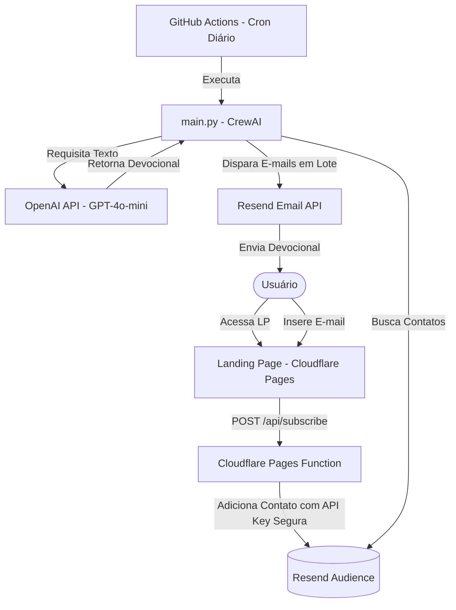

# Plano de Implementação: Newsletter Devocional Autônoma ("Café & Palavra")

Este documento detalha o plano de desenvolvimento e implantação do MVP para a newsletter **Café & Palavra**. O objetivo é um sistema 100% autônomo com custo operacional zero.

---

## 1. Visão Arquitetural

O ecossistema é dividido em três partes principais:



---

## 2. Decisões de Design & Segurança (Essenciais)

### Segurança da API Key do Resend
Para evitar a exposição da API Key do Resend no client-side da Landing Page, utilizaremos **Cloudflare Pages Functions**.
- O frontend enviará o e-mail para a rota local `/api/subscribe`.
- A Function (executada na borda/Edge do Cloudflare) capturará a requisição, lerá a API Key do Resend a partir das variáveis de ambiente configuradas no painel do Cloudflare (oculta do usuário) e fará a chamada segura para a Audience API do Resend.

### Geração de Conteúdo com CrewAI
Utilizaremos `crewai` com dois agentes especializados:
1. **Theologian Agent (Agente Teólogo):** Responsável por ler os temas diários, escolher um versículo adequado (NVI) e escrever uma reflexão teológica curta, focada em liberdade, família e otimismo.
2. **Editor Agent (Agente Redator/Editor):** Responsável por refinar a linguagem (garantindo o tom acolhedor de "café da manhã"), formatar a saída em HTML responsivo e adicionar a "Ação do Dia" e os rodapés com link de PIX e botão de compartilhamento.

### Estrutura Editorial (JSON)
Um arquivo `temas.json` conterá a lista de temas e sentimentos para cada dia da semana (ex: Segunda-feira = Coragem/Início de Semana, Sexta-feira = Gratidão/Família). O script selecionará o tema com base no dia atual ou de forma sequencial para garantir variedade.

---

## Open Questions

> [!IMPORTANT]
> **1. Limites do Resend (Plano Gratuito):**
> O plano gratuito do Resend permite até 3.000 contatos na Audience, mas possui um limite de disparo de **100 e-mails por dia**. Caso a base passe de 100 usuários ativos, o envio diário exigirá upgrade para o plano pago (a partir de US$ 20/mês para 50k envios/mês). Deseja seguir com o Resend mesmo com essa limitação inicial de 100 disparos/dia no plano grátis?
>
> **2. Domínio Customizado:**
> Você já possui um domínio registrado (ex: `cafeepalavra.com.br`) para configurar o DNS (SPF/DKIM/DMARC) no Resend, ou deseja utilizar configurações locais/placeholders temporários?
>
> **3. Chave PIX e Dados de Doação:**
> Qual chave PIX e nome do beneficiário devemos colocar como padrão no rodapé de doações (ou devemos usar placeholders configuráveis via variáveis de ambiente)?

## 3. Mudanças Propostas

### 3.1 Frontend (Landing Page & Página de Obrigado)

#### [NEW] [index.html](file:///C:/Users/victo/Documents/antigravity/wise-hubble/index.html)
Uma página única, super leve e responsiva (mobile-first), com estética premium baseada em tons quentes e terrosos (café, creme, latte, madeira escura).
- **Hero/Dobra Única:** Título inspirador, subtítulo persuasivo ("5 minutos de paz matinal") e formulário com campo de e-mail e botão premium de assinatura.
- **Página de Obrigado integrada (State UI):** Uma transição suave após o envio que esconde o formulário e exibe uma mensagem calorosa acompanhada do botão de compartilhamento viral no WhatsApp.

#### [NEW] [styles.css](file:///C:/Users/victo/Documents/antigravity/wise-hubble/styles.css)
Estilos customizados e modernos.
- Cores HSL (tons de marrom café acolhedores, off-white, contrastes elegantes).
- Tipografia importada do Google Fonts (Playfair Display para títulos, Outfit/Inter para corpo).
- Efeitos visuais como gradientes suaves e micro-animações nos botões e inputs.

#### [NEW] [app.js](file:///C:/Users/victo/Documents/antigravity/wise-hubble/app.js)
Controla o fluxo da Landing Page:
- Captura o evento de submit do formulário.
- Faz uma chamada HTTP assíncrona (`fetch`) para a nossa Cloudflare Function `/api/subscribe`.
- Gerencia estados de carregamento (loading spinner, desativação de botão).
- Trata erros (e-mail inválido, erro de conexão) e atualiza a interface para a tela de agradecimento (sucesso).

#### [NEW] [/functions/api/subscribe.js](file:///C:/Users/victo/Documents/antigravity/wise-hubble/functions/api/subscribe.js)
A Cloudflare Pages Function que serve como proxy seguro para o Resend.
- Recebe o payload `{ email }`.
- Valida o e-mail no servidor.
- Envia uma requisição POST para `https://api.resend.com/audiences/${RESEND_AUDIENCE_ID}/contacts`.
- Autentica usando a variável de ambiente `RESEND_API_KEY`.

---

### 3.2 Cérebro (Script Python de Envio e Geração)

#### [NEW] [requirements.txt](file:///C:/Users/victo/Documents/antigravity/wise-hubble/requirements.txt)
Lista de dependências Python:
```text
crewai>=0.28.0
resend>=2.0.0
pydantic>=2.0.0
```

#### [NEW] [temas.json](file:///C:/Users/victo/Documents/antigravity/wise-hubble/temas.json)
Contém os temas e versículos recomendados ou tópicos geradores para guiar a IA e evitar repetições.

#### [NEW] [main.py](file:///C:/Users/victo/Documents/antigravity/wise-hubble/main.py)
Script principal orquestrado pelo GitHub Actions:
- Carrega as variáveis de ambiente (`OPENAI_API_KEY`, `RESEND_API_KEY`, `RESEND_AUDIENCE_ID`, `SENDER_EMAIL`, `PIX_KEY`).
- Seleciona o tema do dia a partir de `temas.json`.
- Configura e executa a CrewAI (Agente Teólogo + Agente Editor) utilizando o modelo `gpt-4o-mini`.
- A saída estruturada dos agentes será um objeto contendo o assunto do e-mail e o corpo em HTML.
- Consulta todos os contatos ativos na audiência do Resend.
- Dispara os e-mails personalizados em lote usando a API de Envio de E-mails do Resend.

---

### 3.3 Infraestrutura de Automação

#### [NEW] [.github/workflows/daily_newsletter.yml](file:///C:/Users/victo/Documents/antigravity/wise-hubble/.github/workflows/daily_newsletter.yml)
GitHub Actions Workflow configurado para rodar diariamente (cron expression, ex: 09:00 UTC / 06:00 BRT).
- Configura o ambiente Python.
- Instala dependências.
- Executa `main.py` injetando os segredos do repositório (`OPENAI_API_KEY`, `RESEND_API_KEY`, etc.).

---

## 4. Plano de Verificação

### Testes Manuais de Integração
1. **Frontend local:** Rodar a Landing Page localmente e testar a interface de captação e o loop viral.
2. **Teste de Função Serverless:** Simular a chamada da função para garantir a comunicação segura com a API do Resend.
3. **Disparo do Script Python:** Executar o script localmente no modo de teste (enviando para um e-mail de teste em vez de toda a lista).
4. **Verificação de Layout no E-mail:** Garantir que o HTML gerado renderiza perfeitamente no Gmail e Outlook Mobile (responsividade, espaçamentos, legibilidade dos links).
